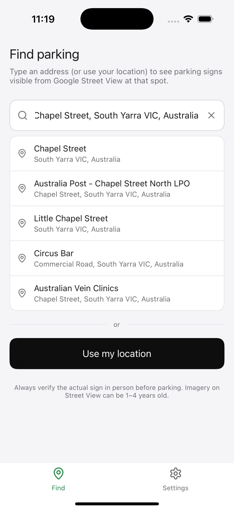
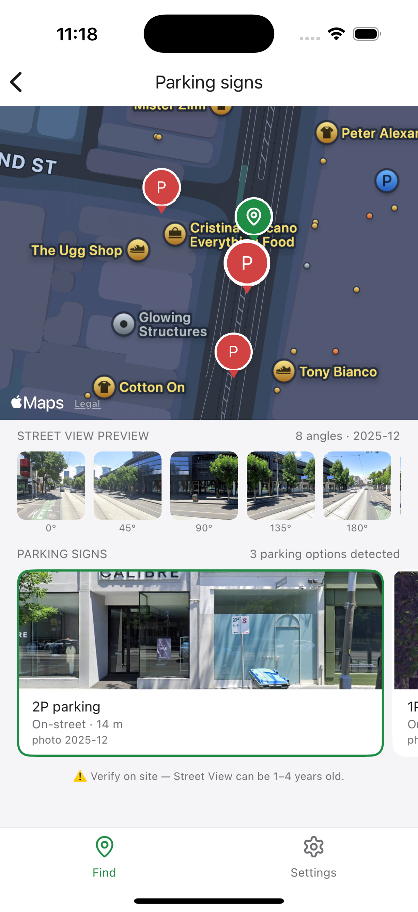
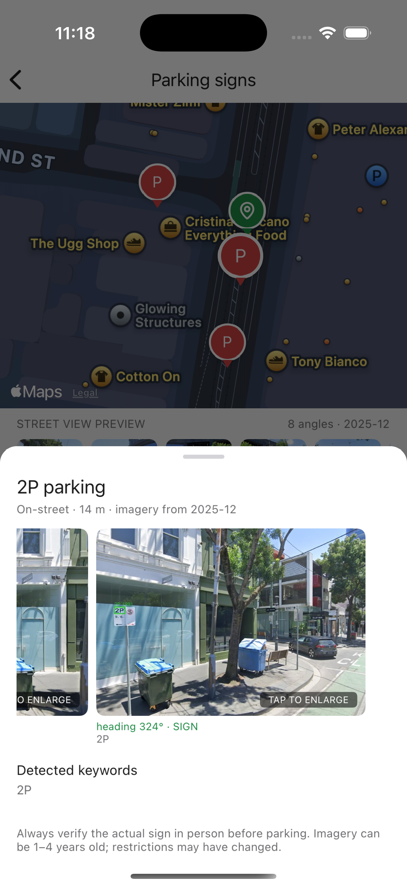
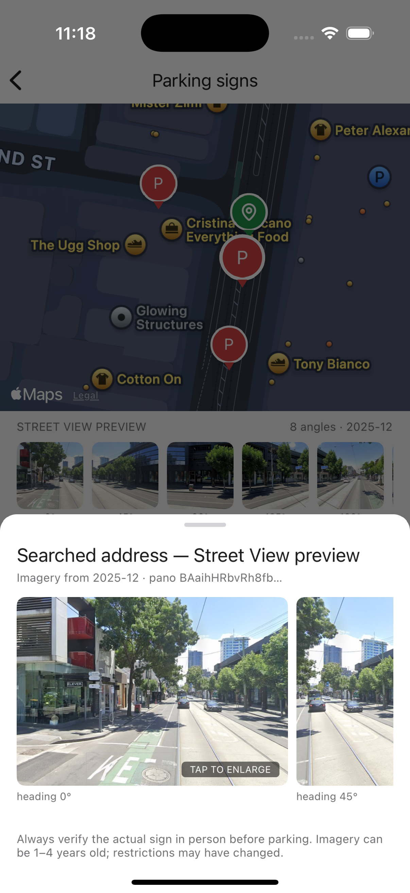
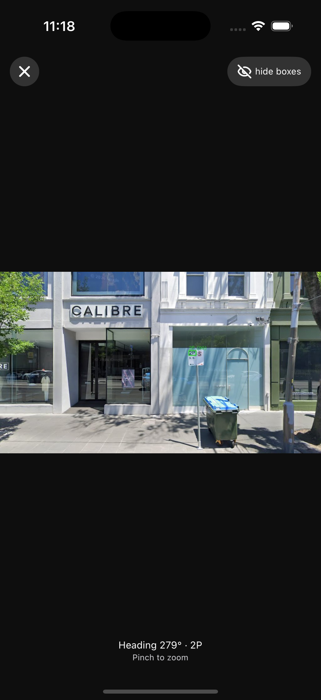
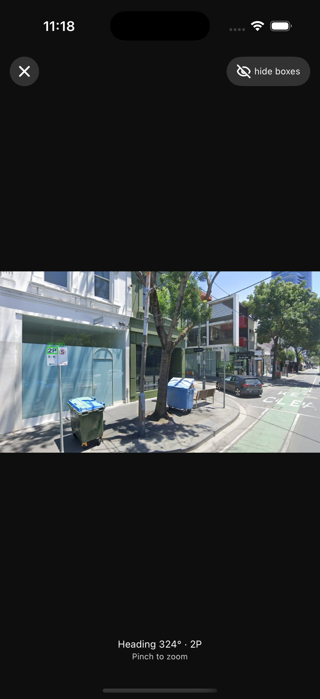
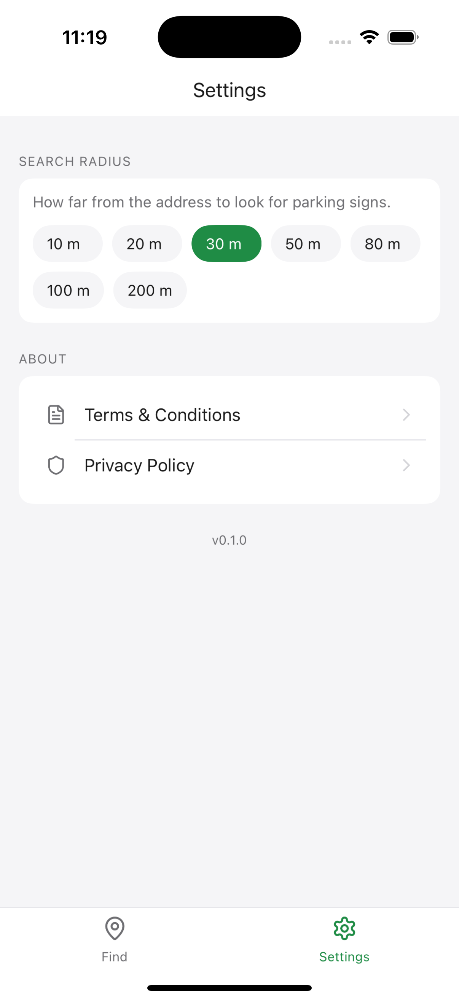

# Parking Sign Detector

Find on-street parking restrictions before you arrive. Enter an address (or use your location), and the app scans Google Street View imagery for parking signs using OCR — then shows results on a map with street-level previews.

## Screenshots

| Search | Results |
| --- | --- |
|  |  |

| Sign detail | Street View |
| --- | --- |
|  |  |

| Full-screen viewer | OCR overlay | Settings |
| --- | --- | --- |
|  |  |  |

## Project structure

| Folder | Description |
| --- | --- |
| [`parking-detector/`](parking-detector/) | Python backend — Street View capture, OCR, FastAPI |
| [`parking-sign-detector-frontend/`](parking-sign-detector-frontend/) | Expo / React Native mobile app |

## Quick start

**Backend**

```bash
cd parking-detector
python3 -m venv .venv && source .venv/bin/activate
pip install -r requirements.txt
cp .env.example .env   # add GOOGLE_MAPS_API_KEY
uvicorn api:app --host 0.0.0.0 --port 8000
```

**Mobile app**

```bash
cd parking-sign-detector-frontend
yarn install
cp .env.example .env   # set EXPO_PUBLIC_API_BASE_URL
yarn ios               # or yarn android
```

See each folder's README for full setup, API docs, and configuration.

## Disclaimer

Street View imagery can be 1–4 years old. Always verify the actual sign on site before parking.
